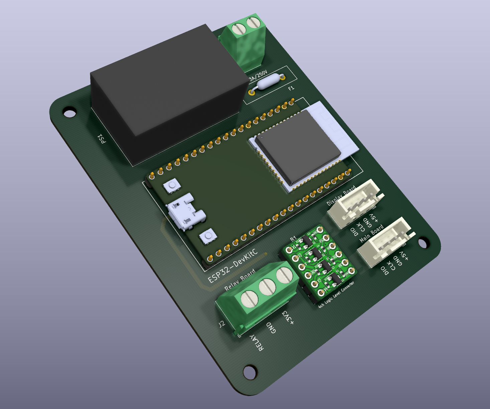
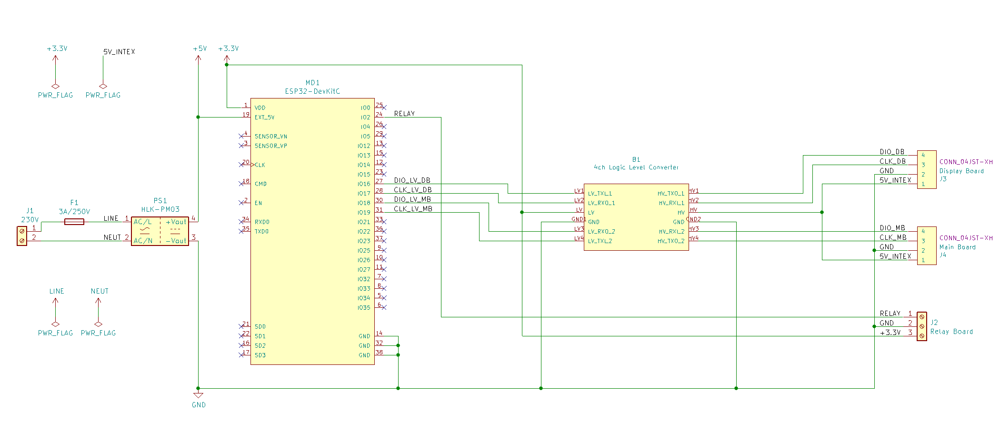

# Intex SWG automaton

NOTE:
Please use this repository instead, as it will work for both the TM1650, and the non TM1650 version of the display board:
https://github.com/jingsno/intex-swg-pcb

This is a PCB for Intex SWG Automation (with TM1650 display board) at
https://github.com/tonyflores1006/intex-swg-iot

Discussion here
https://www.troublefreepool.com/threads/automation-of-intex-swg.228606/

*PCB for Intex SWG automation*

## Schematic

Link to [PDF Schematic](docs/schematic.pdf)

